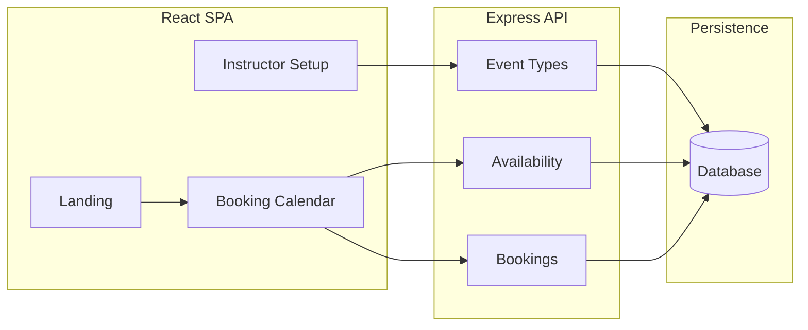
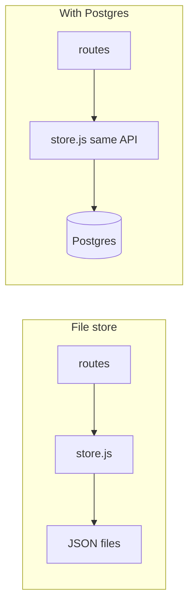

# Architecture

How the Lesson Scheduler is built: structure, stack, data model, API, flows, and persistence.

---

## High-level architecture

Single repo: `server/` (Express API), `client/` (React SPA). Event type URLs: `/book/:eventTypeSlug` (e.g. `/book/30min-intro`). Instructor creates event types and shares these links.

---

## Stack

- **API:** Node.js + Express.
- **Client:** React (SPA), Vite for build and dev.
- **Persistence:** File store (JSON in `server/db/` or `/tmp` on Vercel) or Postgres when `POSTGRES_URL` is set. See [Persistence](#persistence) below.

---

## Data model

**EventType**

- `id`, `slug` (URL path), `name`, `description` (shown to student)
- `durationMinutes`
- `allowRecurring` (boolean), `recurringCount` (number of repeated bookings when recurring is on)
- `availability` — weekly pattern (e.g. weekdays + start/end time per day)
- Mandatory booking fields (v1): first name, last name, email, phone (fixed; no custom fields)

**Booking**

- `id`, `eventTypeId`, `startTime`, `endTime`
- `firstName`, `lastName`, `email`, `phone`
- Optional: `recurringGroupId` when multiple sessions are created in one recurring booking

**Availability**

- Stored on EventType as a weekly pattern (e.g. Mon 9–12, Wed 14–17). Slot generation = intersect this with calendar days, then remove already-booked slots.

### Database schema (Postgres)

When using Postgres, the same concepts map to two tables.

**event_types**

| Column             | Type                         | Notes                    |
| ------------------ | ---------------------------- | ------------------------ |
| id                 | SERIAL PRIMARY KEY           |                          |
| slug               | VARCHAR(255) UNIQUE NOT NULL |                          |
| name               | VARCHAR(255) NOT NULL        |                          |
| description        | TEXT                         | Default ''               |
| duration_minutes   | INTEGER NOT NULL             | Default 30               |
| allow_recurring    | BOOLEAN NOT NULL             | Default false            |
| recurring_count    | INTEGER NOT NULL             | Default 1 (clamped 1–52) |
| availability       | JSONB NOT NULL               | Array of `{day, start, end}`; default `[]` |

**bookings**

| Column             | Type                                        | Notes    |
| ------------------ | ------------------------------------------- | -------- |
| id                 | SERIAL PRIMARY KEY                          |          |
| event_type_id      | INTEGER NOT NULL REFERENCES event_types(id) |          |
| start_time         | TIMESTAMPTZ NOT NULL                        |          |
| end_time           | TIMESTAMPTZ NOT NULL                        |          |
| first_name         | VARCHAR(255) NOT NULL                       |          |
| last_name          | VARCHAR(255) NOT NULL                       |          |
| email              | VARCHAR(255) NOT NULL                       |          |
| phone              | VARCHAR(255)                                |          |
| recurring_group_id | VARCHAR(255)                                | Nullable |

**Indexes:** `event_types(slug)`, `bookings(event_type_id)`, `bookings(start_time)`.

---

## API

| Method | Path                                           | Purpose |
| ------ | ---------------------------------------------- | ------- |
| GET    | `/api/event-types`                             | List (instructor UI). |
| GET    | `/api/event-types/:slug`                       | Public details for booking page. |
| GET    | `/api/event-types/:slug/slots?date=YYYY-MM-DD` | Available start times for a given day. |
| POST   | `/api/bookings`                                | Create booking(s); body: eventTypeSlug, startTime, firstName, lastName, email, phone. |
| POST   | `/api/event-types`                             | Create event type (instructor). |
| GET    | `/api/event-types/id/:id`                      | Get one by id (instructor edit). |
| PATCH  | `/api/event-types/:id`                         | Update event type. |
| GET    | `/api/bookings`                                | List all (instructor calendar). |

No auth in v1; optional shared secret for mutation APIs.

---

## Flows

For a route-to-page map, page-to-API table, and sequence diagrams, see [docs/INTERACTIONS.md](docs/INTERACTIONS.md).

**Student**

1. Landing page → click booking link.
2. `/book/:slug` → load event type (name, description, duration).
3. Calendar → pick day → `GET /api/event-types/:slug/slots?date=…` → pick slot.
4. Form (first name, last name, email, phone) → `POST /api/bookings` → success; optional “add to calendar” link.

**Instructor**

1. `/setup` → list event types (slug, name, duration, booking URL).
2. Create or edit: name, slug, description, duration, weekly availability, recurring toggle + count.
3. Copy booking URL to share.

**Recurring bookings**

- When an event type has “Allow recurring” and a count (e.g. 4), one student submit creates N bookings at the same weekday/time, N weeks in a row (e.g. Wed 10:00 for 4 weeks).

---

## Persistence

**File store** (`server/db/store-file.js`)

- JSON files in `server/db/` locally, or in `/tmp` on Vercel.
- On Vercel, `/tmp` is ephemeral and not shared between serverless invocations, so opening the booking link in a new window can hit an instance with no data (“Event type not found”).

**Postgres** (`server/db/store-pg.js`)

- When `POSTGRES_URL` or `DATABASE_URL` is set, the app uses Postgres. Same store API (`store.eventTypes.*`, `store.bookings.*`); only the implementation changes.
- All instances share the same database, so data persists and the booking link works from any request.

**Switcher:** `server/db/store.js` exports the Postgres store when `POSTGRES_URL` is set, else the file store. No route or client changes.

Setup and rollout (migration, seed, risk, rollback): [planning.md](planning.md) Part 2.

---

## Project layout

| Path            | Purpose |
| --------------- | ------- |
| `server/`       | Express API: routes (event types, slots, bookings), `db/` (store, schema, migrations). |
| `client/`       | React SPA: landing, booking page, instructor setup and calendar. |
| `api/`          | Vercel serverless entry: `api/[[...path]].js` forwards to Express so `/api/*` works on Vercel. |
