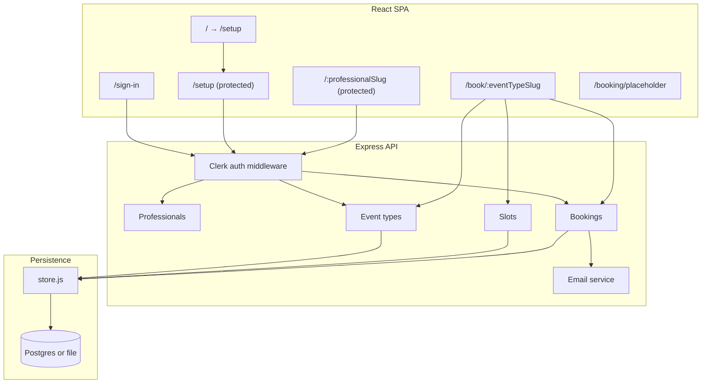

# Architecture

How the Lesson Scheduler is built: structure, stack, data model, API, flows, and persistence. The MVP adds professionals (Clerk auth), scoped event types and bookings, dashboard at `/:professionalSlug`, clients and `client_id`, timezone/price on the booking page, and email confirmations. For a phase-by-phase implementation summary, see [docs/MVP_IMPLEMENTATION_SUMMARY.md](docs/MVP_IMPLEMENTATION_SUMMARY.md).

---

## High-level architecture

Single repo: `server/` (Express API), `client/` (React SPA). Professionals sign in with Clerk; event type booking URLs remain public at `/book/:eventTypeSlug`. Instructor dashboard at `/setup` or `/:professionalSlug`.

---

## Stack

- **API:** Node.js + Express.
- **Client:** React (SPA), Vite for build and dev.
- **Auth:** Clerk (professionals only; clients/guests do not sign in).
- **Persistence:** File store (JSON in `server/db/` or `/tmp` on Vercel) or Postgres when `POSTGRES_URL` is set. Auth and clients require Postgres; file store is for local dev without DB.
- **Email:** Resend (optional); booking confirmations when `RESEND_API_KEY` and `EMAIL_FROM` are set.

---

## Data model

### Professionals (MVP)

- `id`, `clerk_user_id` (Clerk), `email`, `full_name`, `profile_slug` (URL path, unique, not reserved), `time_zone` (IANA).
- Created on first authenticated request when using Postgres.

### Clients (MVP)

- `id`, `email`, `first_name`, `last_name`, `phone`.
- Unique by `(email, first_name, last_name)`. One row per guest; bookings reference `client_id`. Upserted on each booking when using Postgres.

### Slug redirects (MVP)

- `old_slug`, `professional_id`. When a professional changes `profile_slug`, the old slug is stored so `/:oldSlug` can 301 redirect to `/:currentSlug`.

### EventType (MVP)

- `id`, `professional_id`, `slug` (globally unique for `/book/:slug`), `name`, `description`, `duration_minutes`, `allow_recurring`, `recurring_count`, `availability` (weekly pattern), `location`, `time_zone`, `price_dollars`.
- List/create/update scoped to the logged-in professional; GET by slug is public.

### Booking (MVP)

- `id`, `event_type_id`, `client_id` (optional), `start_time`, `end_time`, `duration_minutes`, `first_name`, `last_name`, `email`, `phone`, `recurring_group_id`, `notes`.
- Guest fields kept on booking for display; `client_id` links to `clients` when Postgres is used.

### Availability

- Stored on EventType as a weekly pattern. Slot generation uses event type `time_zone`; intersects availability with calendar days and subtracts already-booked slots; returns UTC ISO with Z.

---

## Database schema (Postgres MVP)

When using Postgres, use the MVP schema: `server/db/schema-mvp.sql`, run with `npm run db:migrate-mvp` (drops and recreates).

**Tables:** `professionals`, `clients`, `slug_redirects`, `event_types` (with `professional_id`, `time_zone`, `price_dollars`, `location`), `bookings` (with `client_id`, `notes`, `duration_minutes`). See schema file and [docs/MVP_IMPLEMENTATION_PLAN.md](docs/MVP_IMPLEMENTATION_PLAN.md) for column details.

---

## API

| Method | Path | Auth | Purpose |
|--------|------|------|---------|
| GET | `/api/health` | No | Store type (postgres / file). |
| GET | `/api/professionals/reserved-slugs` | No | Reserved path segments. |
| GET | `/api/professionals/by-slug/:slug` | No | Redirect or profile slug resolution. |
| GET | `/api/professionals/me` | Yes | Current professional. |
| PATCH | `/api/professionals/me` | Yes | Update full_name, profile_slug, time_zone. |
| GET | `/api/event-types` | Yes | List event types (scoped). |
| GET | `/api/event-types/id/:id` | Yes | Get one by id (edit). |
| GET | `/api/event-types/:slug` | No | Public details for booking page. |
| GET | `/api/event-types/:slug/slots?date=YYYY-MM-DD` | No | Available start times (timezone-aware). |
| POST | `/api/event-types` | Yes | Create event type. |
| PATCH | `/api/event-types/:id` | Yes | Update event type. |
| GET | `/api/bookings` | Yes | List bookings (scoped). |
| GET | `/api/bookings/:id` | Yes | Get one booking. |
| PATCH | `/api/bookings/:id` | Yes | Update booking (overlap check). |
| DELETE | `/api/bookings/:id` | Yes | Delete booking. |
| POST | `/api/bookings` | No | Create booking(s) (student). |

Auth = `Authorization: Bearer <Clerk session token>`. See [docs/API.md](docs/API.md) for full request/response shapes and errors.

---

## Flows

For route→page map, page→API table, and sequence diagrams, see [docs/INTERACTIONS.md](docs/INTERACTIONS.md).

**Auth**

1. Professional visits `/setup` or `/:professionalSlug` → ProtectedRoute checks Clerk; if not signed in, redirect to `/sign-in`.
2. After sign-in/sign-up, redirect to `/setup` (or intended URL). Client sends Bearer token for protected API calls.

**Student**

1. Opens booking link `/book/:slug` (no auth).
2. Load event type (name, description, duration, price, time zone).
3. Pick day → GET slots for that date (timezone-aware) → pick slot.
4. Form (first name, last name, email, phone) → POST /api/bookings. Client upserted (if Postgres); bookings created with client_id.
5. On success: confirmation emails sent to client and professional (if Resend configured); optional add-to-calendar link; link in email to `/booking/placeholder` (cancel/edit coming soon).

**Instructor**

1. `/setup` or `/:professionalSlug` (own slug) → list event types, create/edit, view bookings.
2. Create or edit event type: name, slug, description, duration, availability, recurring, location, time zone, price.
3. Copy booking URL to share. Bookings calendar: month/week/day; click booking → edit page (date, time, duration, contact, notes); PATCH with overlap check; DELETE.

**Slug redirects**

- When professional changes profile_slug, old slug is stored. Visiting `/:oldSlug` returns redirectTo → client navigates to `/:currentSlug`.

---

## Persistence

**File store** (`server/db/store-file.js`)

- JSON files in `server/db/` locally or `/tmp` on Vercel (ephemeral).
- Professionals and clients stubs return null/reject (Auth requires Postgres). Event types and bookings work for local dev without DB.

**Postgres** (`server/db/store-pg.js`)

- When `POSTGRES_URL` or `DATABASE_URL` is set, the app uses Postgres. Same store API; professionals, clients, slug_redirects, scoped event types and bookings, and clients.upsert + client_id on bookings are fully supported.

**Switcher:** `server/db/store.js` exports Postgres store when `POSTGRES_URL` is set, else file store.

---

## Environment variables

| Variable | Required | Purpose |
|----------|----------|---------|
| `POSTGRES_URL` or `DATABASE_URL` | No (optional) | When set, use Postgres; otherwise file store. Auth and clients require Postgres. |
| `VITE_CLERK_PUBLISHABLE_KEY` | Yes (for auth) | Clerk publishable key (client). |
| `CLERK_SECRET_KEY` | Yes (for auth) | Clerk secret key (server). |
| `RESEND_API_KEY` | No | When set, send booking confirmation emails via Resend. |
| `EMAIL_FROM` | No | From address for email (e.g. `Lesson Scheduler <onboarding@resend.dev>`). |
| `BASE_URL` | No | Absolute base URL for links in emails (e.g. `https://your-app.vercel.app`). |

See `.env.example` and [docs/API.md](docs/API.md).

---

## Project layout

| Path | Purpose |
|------|---------|
| `server/` | Express API: auth middleware, routes (professionals, event-types, slots, bookings), services (email), db (store, schema, migrations). |
| `client/` | React SPA: sign-in/sign-up, booking page, instructor setup and calendar, placeholder page; ClerkProvider, protected routes, basePath for /setup and /:professionalSlug. |
| `api/` | Vercel serverless: `api/[[...path]].js` forwards to Express. |
| `docs/` | API.md, FILES.md, INTERACTIONS.md, MVP_IMPLEMENTATION_PLAN.md, MVP_IMPLEMENTATION_SUMMARY.md, POSTGRES_SETUP.md. |
