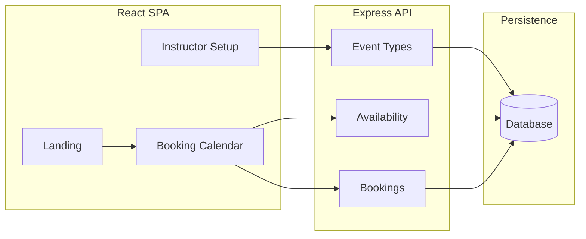

# Calendly-Style Scheduler with Recurring Bookings (v1)

## Product summary

- **Student side:** Landing page with a booking link → calendar → pick day → see available slots → fill form (name, phone, email) → submit → backend stores booking and confirms.
- **Instructor side (no auth):** One setup UI (protected by shared secret or open for v1) to create/edit event types. Each event type has its own URL slug, description, duration, weekly availability, mandatory fields, and optional "book repeatedly" + number of repeated bookings.
- **Stack:** Node.js + Express (API), React (SPA for both booking and instructor UIs). Persistence: file store (JSON) or Postgres; see below.

### Run locally

1. From the repo root: `npm install` then `cd client && npm install`.
2. **Without a database:** Create data files: `npm run db:migrate`. Data lives in `server/db/*.json`.
3. **With Postgres (optional):** Set `POSTGRES_URL` or `DATABASE_URL` in `.env`, then run `npm run db:migrate-pg` once. Optionally seed from existing JSON: `npm run db:seed-pg`.
4. Start API and client: `npm run dev` (API on port 3001, React dev server on port 3000 with proxy to API).
5. Open http://localhost:3000 — use **Instructor setup** to create an event type (name, slug, weekly availability), then open the booking link or use the landing example link.

---

## Persistence: database and data store

**Database** here means the actual persistence technology (e.g. **Postgres**). It stores tables, runs SQL, and persists across restarts and across multiple processes.

**Data store** is the app’s abstraction for reading and writing that data: the object in `server/db/store.js` used by the API (`store.eventTypes.*`, `store.bookings.*`). The data store has a single interface; its **backing** can be files or a database.

- **File-backed store** (`store-file.js`): JSON files in `server/db/` locally, or in `/tmp` on Vercel. No setup, but on Vercel `/tmp` is ephemeral and not shared between serverless invocations, so creating an event and then opening the booking link in a new window can hit a different instance with no data and show “Event type not found.”
- **Postgres-backed store** (`store-pg.js`): When `POSTGRES_URL` or `DATABASE_URL` is set, the app uses this. All instances share the same database, so event types and bookings persist and the booking link works from any window or request.

**How the app chooses:** `server/db/store.js` checks for `POSTGRES_URL` or `DATABASE_URL`. If set, it exports the Postgres store; otherwise the file store. No code changes in routes.

### Using Postgres (e.g. on Vercel)

1. **Create a Postgres database**  
   Any Postgres with a connection URL works. On Vercel, use the **Neon** integration (Vercel Marketplace) or another provider (e.g. Supabase). Add the connection URL as `POSTGRES_URL` (or `DATABASE_URL`) in the project’s environment variables.

2. **Run the migration once**  
   So tables exist. Locally: set `POSTGRES_URL` in `.env`, then from the repo root run:
   ```bash
   npm run db:migrate-pg
   ```
   On Vercel you can run this once from your machine with `POSTGRES_URL` set to the same URL, or use your provider’s SQL console to run the contents of `server/db/schema.sql`.

3. **Optional: seed from existing JSON**  
   If you have data in `server/db/event_types.json` and `server/db/bookings.json` and want to copy it into Postgres (e.g. after first setting up the DB):
   ```bash
   npm run db:seed-pg
   ```
   Tables should be empty or have matching ids; re-running may hit duplicate-key errors.

4. **Deploy**  
   With `POSTGRES_URL` set in Vercel, the serverless API will use Postgres. Creating an event and opening the booking link in a new window will then work, because every request reads from the same database.

---

## Architecture (high level)



- **Single repo:** `server/` (Express), `client/` (React), shared env for API base URL.
- **Event type URL:** Same base (e.g. yourdomain.com) with path like `/book/:eventTypeSlug` (e.g. `/book/30min-intro`). Instructor creates event types and gets these links to share.

---

## Data model (v1)

- **EventType**
  - `id`, `slug` (URL path), `name`, `description` (shown to student)
  - `durationMinutes`
  - `allowRecurring` (boolean), `recurringCount` (number of repeated bookings when recurring is on; recurrence rule TBD, e.g. same time weekly)
  - `availability` (e.g. JSON: weekdays + start/end time per day, or simple "weekly schedule")
  - Mandatory fields for v1: first name, last name, phone, email (fixed; no custom fields in v1)
- **Booking**
  - `id`, `eventTypeId`, `startTime` (datetime), `endTime`
  - `firstName`, `lastName`, `email`, `phone`
  - Optional: `recurringGroupId` if we create multiple bookings in one "recurring" action
- **Availability (v1):** Stored on EventType as a simple weekly pattern (e.g. Mon 9–12, Wed 14–17). Slot generation = intersect this with "open" days in the calendar, then remove already-booked slots.

---

## Student flow (v1)

1. **Landing page**
   - Marketing-style page with CTA that links to `/book/:eventTypeSlug` (instructor shares this link).
2. **Booking page** (`/book/:eventTypeSlug`)
   - Load event type by slug (name, description, duration).
   - Show calendar; user selects a day.
   - Call API: `GET /api/event-types/:slug/slots?date=YYYY-MM-DD` → list of available start times for that day.
   - User picks a slot, then sees form: First name, Last name, Email, Phone (all required).
   - On submit: `POST /api/bookings` with `eventTypeSlug`, `startTime`, and form data. Backend creates booking(s); if event type has "recurring" and we implement it in v1, create N bookings (e.g. same time weekly for N weeks).
   - Show success state and optionally "add to calendar" / confirmation message.
3. **Backend**
   - Validate slot still available, then persist booking and return success (and send "notification to backend" = event stored; optional internal log or webhook later).

---

## Instructor flow (v1)

1. **Access**
   - Route like `/setup` or `/instructor`. No login; optional v1: protect with a single shared secret (e.g. query param or env-based check) or leave open for local use.
2. **Event type list**
   - List all event types with slug, name, duration. Link to "create" and "edit", and show booking URL to copy.
3. **Create / Edit event type**
   - **Basic:** Name, URL slug (editable), description (text shown to student).
   - **Schedule:** Duration (e.g. 15 / 30 / 60 min). Weekly availability (e.g. checkboxes for days + time range per day, or simple table).
   - **Form:** Mandatory fields = First name, Last name, Phone, Email (fixed for v1; no custom fields).
   - **Recurring:** "Allow recurring bookings" toggle; "Number of repeated bookings" (e.g. 2–10). When on, one student booking can create that many sessions (recurrence rule: e.g. same weekday/time, weekly; to be confirmed in implementation).
   - Save → PATCH/PUT event type; new ones POST. Return or display the public URL: `{baseUrl}/book/{slug}`.

---

## API (minimal v1)

| Method | Path                                           | Purpose                                                                                                                                            |
| ------ | ---------------------------------------------- | -------------------------------------------------------------------------------------------------------------------------------------------------- |
| GET    | `/api/event-types`                             | List (for instructor UI).                                                                                                                          |
| GET    | `/api/event-types/:slug`                       | Public details for booking page (name, description, duration).                                                                                     |
| GET    | `/api/event-types/:slug/slots?date=YYYY-MM-DD` | Available start times for a given day.                                                                                                             |
| POST   | `/api/bookings`                                | Create booking(s): body = eventTypeSlug, startTime, firstName, lastName, email, phone; optional recurring flag/count if we support it in UI in v1. |
| POST   | `/api/event-types`                             | Create event type (instructor).                                                                                                                    |
| GET    | `/api/event-types/:id`                         | Get one (instructor edit).                                                                                                                         |
| PATCH  | `/api/event-types/:id`                         | Update event type (instructor).                                                                                                                    |
| GET    | `/api/bookings`                               | List all bookings (for instructor calendar); returns full_name, event_type_name, recurring_session.                                              |

No auth on these for v1; optionally restrict `/api/event-types` POST/PATCH with a shared secret header or query param.

---

## Recurring bookings (v1 detail)

- **Instructor:** Per event type: "Allow recurring" on/off + "Number of repeated bookings" (e.g. 4).
- **Behavior:** When a student books a slot and the event type has recurring on, backend creates N bookings at the same weekday/time, N weeks in a row (e.g. slot "Wed 10:00" → book Wed 10:00 for weeks 1–4). Exact rule (weekly vs every-2-weeks, etc.) can be fixed in implementation or made configurable later.
- **Student UI:** If recurring is on, we can show "You're booking 4 sessions at this time (weekly)" and then one form submit creates all N bookings.

---

## Implementation order

1. **Project setup** – Repo with `server/` (Express, one port) and `client/` (React, dev proxy to API). DB choice (e.g. SQLite for v1) and one migration or script to create `event_types` and `bookings` tables.
2. **Event types (CRUD)** – API + instructor UI: create/list/edit event types with slug, name, description, duration, weekly availability, mandatory fields (fixed), recurring toggle + count.
3. **Slots API** – Given `eventTypeId` + date, compute available start times (weekly pattern minus existing bookings); expose as `GET /api/event-types/:slug/slots?date=`.
4. **Public booking page** – React: load event type by slug, calendar + day picker, fetch slots, form (first name, last name, email, phone), submit booking(s). Show success.
5. **Create booking(s) API** – POST body validation, conflict check, insert one or N bookings (if recurring); return success/ids.
6. **Landing page** – Simple marketing page with link to `/book/:eventTypeSlug` (slug can be example or config-driven).
7. **Recurring in UI** – When event type has recurring on, show copy like "4 weekly sessions" and ensure POST creates N bookings with correct dates.

Optional before or after: protect `/setup` (and mutation APIs) with a shared secret; add minimal styling and mobile-friendly layout.

---

## Out of scope for v1

- Instructor sign-up/login; multi-tenant (multiple instructors).
- Custom mandatory fields beyond name, phone, email.
- Calendar sync (Google/Outlook), email reminders, or timezone UI (can assume one timezone or server timezone).
- Payments or cancellation flows (can add later).

---

## Open point

- **Recurrence rule:** Currently assumed "same weekday/time, weekly, for N bookings." If you want a different rule (e.g. every 2 weeks, or student picks interval), we can adjust the API and UI in the implementation step.

---

## Additions (steps)

New features are documented here as Step 2, Step 3, and so on. Each time we add something, it is appended as the next step.

**Step 2: Instructor landing + separate create/edit + recurring**

- **Instructor landing page** (`/setup`): Lists all event types with name, duration, booking URL, and a "Recurring (N sessions)" badge when applicable. "Create new event" and "View bookings" links; per event: "Copy link" and "Edit."
- **Create event page** (`/setup/new`): Dedicated page for creating a new event type (name, slug, description, duration, weekly availability, "Allow recurring bookings" toggle, "Number of repeated bookings"). Save redirects to instructor home.
- **Edit event page** (`/setup/:id/edit`): Same form as create, loaded by event id; slug read-only. Save redirects to instructor home.
- **Recurring booking**: Already supported in API and student flow; create/edit form includes recurring option; instructor home shows recurring badge.

**Step 3: Bookings calendar**

- **Bookings page** (`/setup/bookings`): Calendar view of all current bookings. Reachable from instructor home via "View bookings."
- **Views**: Day, week, and month. Toolbar: Previous / Today / Next, current range title, view toggle (Day | Week | Month).
- **Month view**: Grid of the month; each day shows that day’s bookings with **full name** only.
- **Week view**: Seven-day week with hourly rows; each cell shows bookings that start in that hour on that day with **full name**.
- **Day view**: Single day with **lesson count** at top ("X lessons today" or "No lessons today"). Each booking shows time range, **full name**, event type name, and **"Session X of Y"** when part of a recurring series.
- **API**: `GET /api/bookings` returns all bookings with `full_name`, `event_type_name`, and `recurring_session` (index/total) for calendar use.

**Step 4: Recurring count server-side cap**

- **Problem:** `recurringCount` was only floored (min 1), never capped. A large stored value could make `POST /api/bookings` create thousands of sessions in one request (long sync work, huge `bookings.json` writes).
- **Solution:** A maximum recurring count (e.g. 52, ~1 year weekly) is enforced server-side.
- **Store** (`server/db/store.js`): On event type create and update, `recurringCount` is clamped to `[1, MAX_RECURRING_COUNT]` via `clampRecurringCount()`. On update, existing values are re-clamped when reading so old or hand-edited data is corrected on save.
- **Bookings route** (`server/routes/bookings.js`): When building recurring sessions for `POST /api/bookings`, the count used is `clampRecurringCount(eventType.recurringCount)` so even pre-existing large values never create more than the cap per request.

**Step 5: Calendly-style UI (booking page + instructor calendar)**

- **Booking page** (`/book/:eventTypeSlug`):
  - **Layout:** Two columns on desktop (event summary left, steps right); single column on mobile (summary then steps). Event summary card is sticky on desktop only.
  - **Calendar:** One month at a time with ‹ / › month navigation; selected date has a clear highlight (primary background). Past days disabled.
  - **Time slots:** Shown as chip-style buttons in a wrapped row ("Choose a time").
  - **Form:** Same fields (first name, last name, email, phone) with placeholders; single "Schedule event" button.
  - **Success:** "You're scheduled" with checkmark, short confirmation text, and **Add to calendar** link that opens Google Calendar with the event pre-filled (title, start, end).
  - **Design:** Light gray page background, white cards, shared borders/shadows, primary color for actions and links.
- **Instructor calendar** (`/setup/bookings`):
  - Same design system as the booking page (background, borders, primary color, border radius, shadows).
  - Toolbar: Prev (‹) / Today / Next (›) and Day | Week | Month use consistent button styling.
  - Month view: Slightly larger day cells and spacing; event pills use a blue tint.
  - Week view: Same event pill style; clearer hour/day labels.
  - Day view: Event blocks with more padding and light background; time, name, event type, and "Session X of Y" when recurring.

---

## Implementation plans

Detailed implementation plans (e.g. Add Real Database for Vercel: schema, steps, files changed, risk) are in **[planning.md](planning.md)**. The README above summarizes what the app does and how to run it; planning.md holds the step-by-step plan and rollout notes.
