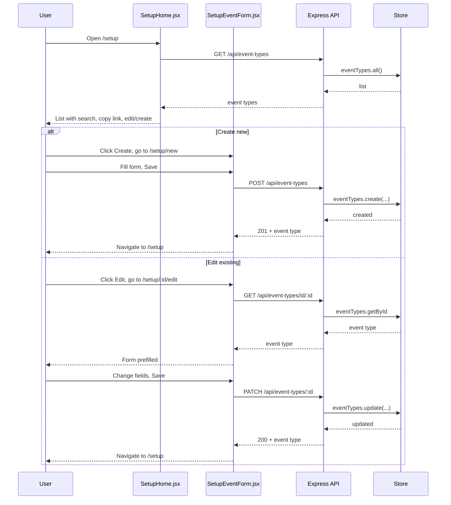
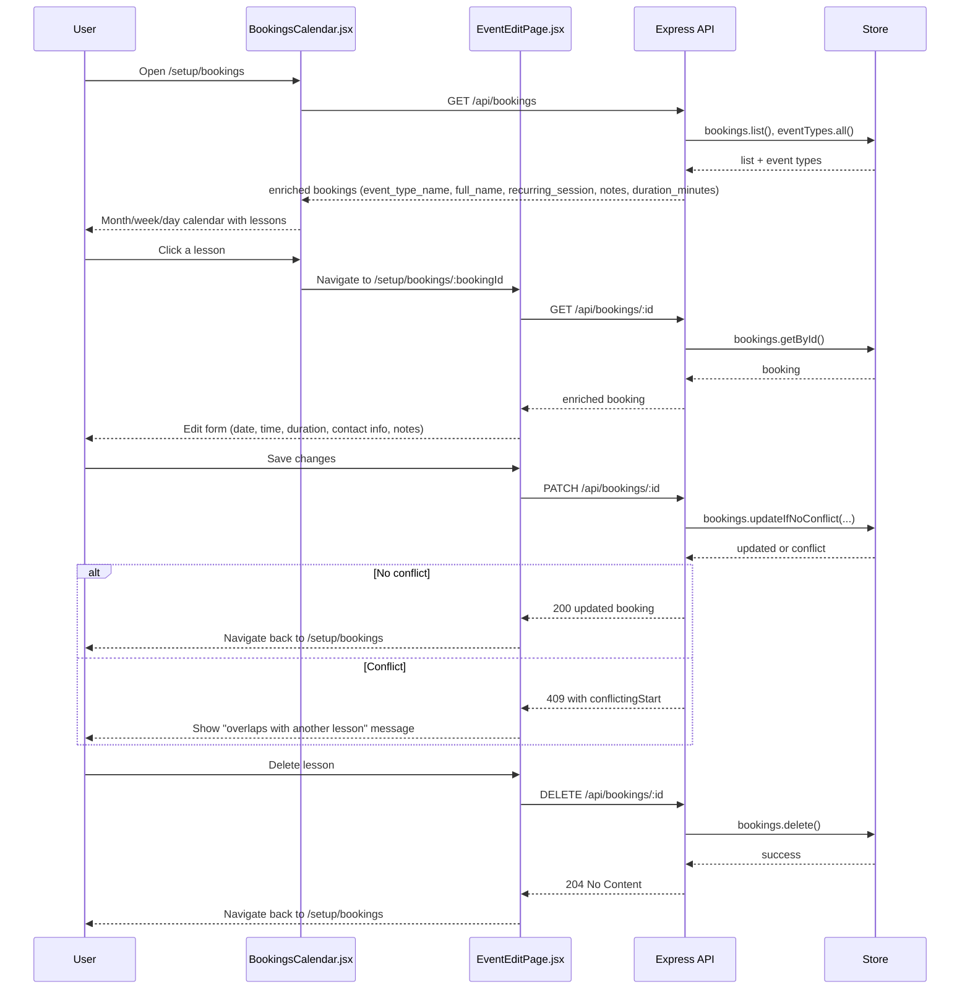
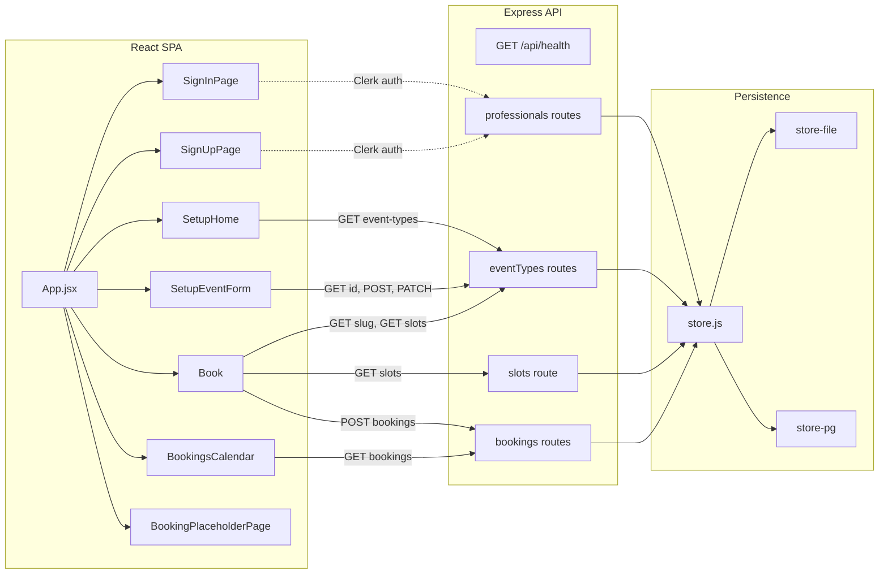

# Interactions

Which routes render which pages, which pages call which APIs, and how data flows. See [ARCHITECTURE.md](../ARCHITECTURE.md) for data model and persistence, and [API.md](API.md) for full endpoint details.

---

## Route to page map

| URL | Layout | Page / component |
|-----|--------|-------------------|
| `/` | — | Redirect to `/setup` |
| `/sign-in` | — | **SignInPage** (Clerk sign-in; redirect to /setup after) |
| `/sign-up` | — | **SignUpPage** (Clerk sign-up; redirect to /setup after) |
| `/book/:eventTypeSlug` | — | **Book** (`client/src/pages/Book.jsx`) |
| `/booking/placeholder` | — | **BookingPlaceholderPage** (cancel/edit coming soon) |
| `/setup` | ProtectedRoute → InstructorLayout | **SetupHome** (index) |
| `/setup/new` | InstructorLayout | **SetupEventForm** (create) |
| `/setup/:id/edit` | InstructorLayout | **SetupEventForm** (edit) |
| `/setup/bookings` | InstructorLayout | **BookingsCalendar** |
| `/setup/bookings/:bookingId` | InstructorLayout | **EventEditPage** |
| `/:professionalSlug` | ProtectedRoute → ProfessionalSlugGuard → InstructorLayout | Same as `/setup` (Scheduling + Bookings) when slug is current user’s profile slug; reserved slug → redirect to `/setup`; old slug → redirect to current slug |
| `/:professionalSlug/new`, `/:professionalSlug/bookings`, etc. | (as above) | **SetupEventForm**, **BookingsCalendar**, **EventEditPage** (same as under `/setup`) |
| `*` | — | Redirect to `/` |

---

## Page to API map

| Page / component | Endpoint(s) used |
|------------------|------------------|
| **SetupHome** | `GET /api/event-types` |
| **SetupEventForm** | `GET /api/event-types/id/:id` (edit only), `POST /api/event-types` (create), `PATCH /api/event-types/:id` (update) |
| **Book** | `GET /api/event-types/:slug`, `GET /api/event-types/:slug/slots?date=YYYY-MM-DD`, `POST /api/bookings` |
| **BookingsCalendar** | `GET /api/bookings` |
| **EventEditPage** | `GET /api/bookings/:id`, `PATCH /api/bookings/:id`, `DELETE /api/bookings/:id` |
| **ProfessionalSlugGuard** | `GET /api/professionals/me`, `GET /api/professionals/by-slug/:slug` (public, for redirect resolution) |
| **SignInPage** / **SignUpPage** | Clerk-hosted; no direct API (Clerk handles auth). After sign-in, client uses Bearer token for protected endpoints. |

---

## Auth flow

Professionals must sign in to access `/setup` or `/:professionalSlug`. Unauthenticated users are redirected to `/sign-in` (with `state.from` for post-login redirect). After sign-in or sign-up, Clerk redirects to `/setup` (or the intended URL). The client sends `Authorization: Bearer <token>` (via `useApi().apiFetch`) for all protected endpoints: event-types list/create/patch, bookings list/get/patch/delete, professionals/me.

---

## Student booking flow

User opens a booking link (e.g. `/book/30min-intro`), picks a day, sees slots, fills the form, and submits.

```mermaid
sequenceDiagram
  participant User
  participant BookPage as Book.jsx
  participant API as Express API
  participant Store as Store

  User->>BookPage: Open /book/:slug
  BookPage->>API: GET /api/event-types/:slug
  API->>Store: getBySlug
  Store-->>API: event type
  API-->>BookPage: event type (name, duration, availability)
  BookPage-->>User: Show calendar + description

  User->>BookPage: Pick date
  BookPage->>API: GET /api/event-types/:slug/slots?date=
  API->>Store: getBySlug, getBookingsOnDate
  API-->>BookPage: available start times
  BookPage-->>User: Show time slots

  User->>BookPage: Pick slot, fill form, submit
  BookPage->>API: POST /api/bookings (eventTypeSlug, startTime, firstName, ...)
  API->>Store: createBatchIfNoConflict
  Store-->>API: created / conflict
  API->>API: sendBookingConfirmation (client + professional email; optional, never fails request)
  API-->>BookPage: 201 or 409
  BookPage-->>User: Success or slot taken; optional add-to-calendar link
```

---

## Instructor setup flow

Instructor goes to `/setup`, lists event types, creates or edits one, then copies the booking URL to share.



---

## Instructor calendar and booking edit flow

Instructor goes to `/setup/bookings` to see all upcoming lessons, then clicks one to adjust time, duration, or details, with conflict checks enforced by the API.



---

## Client–server overview

React app (client) talks only to the Express API. The API uses a single store interface; the implementation is either file-backed or Postgres depending on env.


