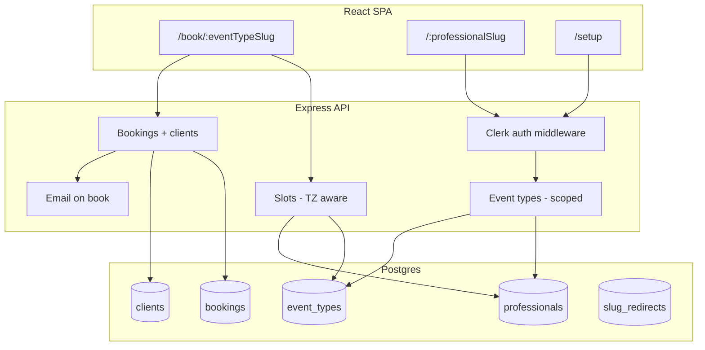

# MVP Implementation Plan

Implementation plan derived from [MVP_MITIGATION_QUESTIONS.md](MVP_MITIGATION_QUESTIONS.md). Deploy: wipe DB and start fresh.

---

## Summary of changes (by phase)

What changes in each phase, from current app to MVP:

**Phase 1 — Database schema**
- **DB:** New schema: tables `professionals`, `clients`, `slug_redirects`; `event_types` recreated with `professional_id`, `time_zone`, `price_dollars`; `bookings` with `client_id`. Existing `event_types` and `bookings` dropped (wipe and start fresh).
- **Tooling:** New `schema-mvp.sql`, `migrate-mvp-pg.js`, npm script `db:migrate-mvp`. No app code changes yet.

**Phase 2 — Clerk + professionals API**
- **Auth:** Professionals sign in with Clerk; no auth for clients. `/setup` and professional-only API require sign-in.
- **Users (professionals):** `professionals` table used; create row on first Clerk sign-in; `GET /api/professionals/me`, `PATCH /api/professionals/me` (full_name, profile_slug, time_zone). Reserved path segments enforced for profile_slug.
- **Client:** Sign-in/sign-up flows; redirect after login to `/setup`; send Clerk token to protected API.

**Phase 3 — Professional-scoped event types and bookings**
- **Event types:** Each has `professional_id`; list/create/update scoped to logged-in professional; public `GET /api/event-types/:slug` unchanged (slug globally unique).
- **Bookings:** List and get/patch/delete filtered by professional’s event types; `POST /api/bookings` stays public.

**Phase 4 — Dashboard at /:professionalSlug**
- **Instructor URL:** Dashboard available at `/:professionalSlug` (and `/setup`); reserved paths rejected.
- **Slug redirects:** When profile_slug changes, old slug 301 redirects to current slug (via `slug_redirects` table).

**Phase 5 — Timezone and price on booking page**
- **Slots:** Generated using event type `time_zone`; stored TIMESTAMPTZ.
- **Price:** `event_types.price_dollars` returned by API; shown on public booking page.
- **Public booking:** Same URL `/book/:eventTypeSlug`; page shows price and times in professional’s time zone.

**Phase 6 — Clients and client_id**
- **Clients:** `clients` table used; one row per unique guest (email + first_name + last_name); upsert on each booking.
- **Bookings:** Each booking gets `client_id` set when created; guest fields kept on booking for display.

**Phase 7 — Email on booking**
- **Email:** After creating booking(s), send HTML confirmation to client and to professional (system From, Reply-To professional); template with placeholders; link in email to static placeholder (cancel/edit later). On send failure, booking still created; optional warning in response.

---

## Architecture overview

- **Clients** (guests) book at `/book/:eventTypeSlug` with no auth. We upsert into `clients` (unique by email + first_name + last_name) and link `bookings.client_id`.
- **Professionals** sign in with Clerk. Dashboard at `/:professionalSlug` (and `/setup`); event types and bookings are scoped by `professional_id`. Slug changes: store previous slugs, 301 to current.
- **One-time vs recurring:** Professional sets each event type as one-time only or recurring only (fixed N); client has no choice.
- **Email:** After booking, send HTML to client and professional; From = system address, Reply-To = professional. Link in email goes to static placeholder (cancel/edit later).
- **Timezone:** Event type has `time_zone` (IANA or offset); slots generated in that TZ, stored TIMESTAMPTZ. Booking page shows professional's TZ.
- **Price:** On event type (decimal dollars, 2 decimals); shown on public booking page.

---

## Data model

### professionals

| Column         | Type             | Notes |
|----------------|------------------|-------|
| id             | SERIAL PRIMARY KEY | |
| clerk_user_id  | VARCHAR(255) UNIQUE NOT NULL | From Clerk |
| email          | VARCHAR(255) NOT NULL | Sync from Clerk or store |
| full_name      | VARCHAR(255) NOT NULL DEFAULT '' | |
| profile_slug   | VARCHAR(255) UNIQUE NOT NULL | Unique among professionals; reserved paths forbidden |
| time_zone      | VARCHAR(63) NOT NULL DEFAULT 'America/Los_Angeles' | IANA or offset |
| created_at     | TIMESTAMPTZ NOT NULL DEFAULT now() |
| updated_at     | TIMESTAMPTZ NOT NULL DEFAULT now() |

Reserved path segments (profile_slug cannot be): `book`, `setup`, `api`, `auth`, `sign-in`, `sign-up`, `health`, and any used by React Router (e.g. static assets).

### clients

| Column     | Type             | Notes |
|------------|------------------|-------|
| id         | SERIAL PRIMARY KEY | |
| email      | VARCHAR(255) NOT NULL | |
| first_name | VARCHAR(255) NOT NULL | |
| last_name  | VARCHAR(255) NOT NULL | |
| phone      | VARCHAR(255) | |
| created_at | TIMESTAMPTZ NOT NULL DEFAULT now() |

Unique constraint: `(email, first_name, last_name)`. One row per unique guest; bookings reference `client_id`.

### slug_redirects

| Column            | Type             | Notes |
|-------------------|------------------|-------|
| id                | SERIAL PRIMARY KEY | |
| old_slug          | VARCHAR(255) UNIQUE NOT NULL | Previous profile_slug |
| professional_id   | INTEGER NOT NULL REFERENCES professionals(id) | Redirect to this professional's current slug |

Lookup: on request to `/:slug`, if slug not a current profile_slug, check slug_redirects; if found, 301 to current profile_slug of that professional.

### event_types (changes)

Add columns:

- `professional_id` INTEGER NOT NULL REFERENCES professionals(id)
- `time_zone` VARCHAR(63) NOT NULL DEFAULT 'America/Los_Angeles'
- `price_dollars` DECIMAL(10,2) NOT NULL DEFAULT 0

Event type slug must be **globally unique** so that public URL `/book/:eventTypeSlug` resolves to exactly one event type. Keep UNIQUE(slug) on event_types.

### bookings (changes)

Add column:

- `client_id` INTEGER REFERENCES clients(id)

Keep first_name, last_name, email, phone on booking for denormalized display; set client_id on insert/update after upserting client.

### event_types table (full)

| Column             | Type             | Notes |
|--------------------|------------------|-------|
| id                 | SERIAL PRIMARY KEY | |
| professional_id    | INTEGER NOT NULL REFERENCES professionals(id) | |
| slug               | VARCHAR(255) NOT NULL | Per-professional unique |
| name               | VARCHAR(255) NOT NULL | |
| description        | TEXT NOT NULL DEFAULT '' | |
| duration_minutes   | INTEGER NOT NULL DEFAULT 30 | |
| allow_recurring    | BOOLEAN NOT NULL DEFAULT false | |
| recurring_count    | INTEGER NOT NULL DEFAULT 1 | |
| availability       | JSONB NOT NULL DEFAULT '[]' | |
| location           | VARCHAR(512) | |
| time_zone          | VARCHAR(63) NOT NULL DEFAULT 'America/Los_Angeles' | |
| price_dollars      | DECIMAL(10,2) NOT NULL DEFAULT 0 | |

UNIQUE(slug) — global, so `/book/:eventTypeSlug` has one match.

### bookings table (full)

Existing columns plus:

- `client_id` INTEGER REFERENCES clients(id)

---

## API changes

- **Auth:** Protect routes that mutate or list professional data: require Clerk session; resolve Clerk user to `professional_id` (via professionals.clerk_user_id). Public: `GET /api/event-types/:slug`, `GET /api/event-types/:slug/slots`, `POST /api/bookings` stay unauthenticated.
- **Event types list:** `GET /api/event-types` → returns only event types for the logged-in professional.
- **Event types create/update:** `POST /api/event-types`, `PATCH /api/event-types/:id` → set professional_id from session; validate slug is globally unique (one slug across all professionals for public `/book/:eventTypeSlug`).
- **Event type by slug (public):** `GET /api/event-types/:slug` → returns the single event type with that slug (globally unique).
- **Bookings list:** `GET /api/bookings` → only for logged-in professional; filter by their event types.
- **Slots:** `GET /api/event-types/:slug/slots?date=YYYY-MM-DD` → use event type's time_zone to build slots in that TZ, return/store UTC (TIMESTAMPTZ).
- **POST /api/bookings:** Create booking(s); upsert client (email + first_name + last_name); set booking.client_id. Then send confirmation emails (system From, Reply-To professional); link in email to placeholder page.
- **Professionals:** `GET /api/me` or `GET /api/professionals/me` → current professional (from Clerk). `PATCH /api/professionals/me` → update full_name, profile_slug, time_zone. On profile_slug change, insert into slug_redirects (old_slug → professional_id).

Reserved paths: `book`, `setup`, `api`, etc. — when validating profile_slug, reject these.

---

## Client routes

- `/` → redirect to `/setup` (or to `/:professionalSlug` if we want landing to be professional dashboard when logged in; spec says after login go to /setup).
- `/setup` → requires auth; professional's setup (event types list, create/edit, bookings calendar). Can redirect to `/:professionalSlug` if we want single dashboard URL.
- `/:professionalSlug` → professional dashboard (list event types + bookings tab). Requires auth; slug must match current professional or 301 from old slug. Reserved paths return 404 or redirect.
- `/book/:eventTypeSlug` → public booking; no auth; show price; slots in event type's TZ; one-time or recurring per event type (no client choice).

---

## Implementation phases (detailed steps)

### Phase 1 — Database schema

**Goal:** New Postgres schema for professionals, clients, slug_redirects, event_types (with professional_id, time_zone, price_dollars), bookings (with client_id). Wipe existing data and create tables.

**Steps:**

1. Add `server/db/schema-mvp.sql` with:
   - `DROP TABLE IF EXISTS` for bookings, event_types, slug_redirects, clients, professionals (in dependency order).
   - `CREATE TABLE professionals` (id, clerk_user_id, email, full_name, profile_slug, time_zone, created_at, updated_at); indexes on clerk_user_id, profile_slug.
   - `CREATE TABLE clients` (id, email, first_name, last_name, phone, created_at); UNIQUE(email, first_name, last_name).
   - `CREATE TABLE slug_redirects` (id, old_slug, professional_id); index on old_slug.
   - `CREATE TABLE event_types` with professional_id, time_zone, price_dollars; UNIQUE(slug) global; index on professional_id.
   - `CREATE TABLE bookings` with client_id FK to clients; keep existing columns.
2. Add `server/db/migrate-mvp-pg.js` that reads schema-mvp.sql and runs each statement (same pattern as migrate-pg.js).
3. Add npm script `db:migrate-mvp` in package.json pointing to migrate-mvp-pg.js.
4. Document in FILES.md: schema-mvp.sql, migrate-mvp-pg.js.

**Deliverables:** schema-mvp.sql, migrate-mvp-pg.js, package.json script, FILES.md updated. No app code changes yet; existing store and routes still use old schema until Phase 3.

**Status:** Done.

---

### Phase 2 — Clerk + professionals API + protect /setup

**Goal:** Professionals sign in with Clerk; backend verifies Clerk session and resolves to professional; create/update professional row on first sign-in; protect /setup and professional-only API.

**Steps:**

1. **Clerk in client**
   - Install `@clerk/clerk-react` in client.
   - Wrap app (or router) with `ClerkProvider` (need `VITE_CLERK_PUBLISHABLE_KEY` or `REACT_APP_...`).
   - Add sign-in and sign-up pages or components (e.g. `/sign-in`, `/sign-up`) or use Clerk-hosted URLs.
   - Redirect after sign-in to `/setup` (per spec).
   - Protect `/setup`: wrap route or layout so unauthenticated users redirect to sign-in (e.g. `SignedIn`/`SignedOut` or auth check + redirect).

2. **Clerk backend verification**
   - Install `@clerk/backend` (or use Clerk's JWT verification) in server.
   - Add middleware or helper that: reads Bearer token or session from request; verifies with Clerk; returns clerk_user_id (or 401). Optionally resolve clerk_user_id to professional_id by querying `professionals` (if no row, can 404 or trigger create in Phase 2/3).

3. **Professionals store and API**
   - Add `server/db/store` methods for professionals: getByClerkId(clerk_user_id), getById(id), getByProfileSlug(slug), create(data), update(id, data). If using separate store file for Postgres, add these to store-pg.js and expose via store.js when Postgres is active.
   - Add `server/routes/professionals.js`: `GET /api/professionals/me` (require auth, return current professional); `PATCH /api/professionals/me` (update full_name, profile_slug, time_zone; validate profile_slug not in reserved list; on slug change, insert into slug_redirects(old_slug, professional_id) then update professionals).
   - Reserved path list: e.g. `book`, `setup`, `api`, `auth`, `sign-in`, `sign-up`, `health`, `login`, `logout` — reject these for profile_slug.
   - On first Clerk sign-in (or first request to /api/professionals/me): if no professional for clerk_user_id, create one (clerk_user_id, email from Clerk, full_name from Clerk or '', profile_slug = `user_${clerk_id}` or similar unique default, time_zone default).
   - Mount professionals router in server/app.js (e.g. `app.use('/api/professionals', professionalsRouter)`).
   - Ensure store-pg.js (and store.js) use MVP schema: read/write professionals and slug_redirects. Migration must have been run (Phase 1) before starting app with new code.

4. **Protect professional-only routes**
   - Apply auth middleware to: GET/POST/PATCH event-types (list, create, update), GET/PATCH/DELETE bookings (list, get one, update, delete). Leave public: GET /api/event-types/:slug, GET /api/event-types/:slug/slots, POST /api/bookings.
   - Return 401 when no valid Clerk session (and optionally 403 when professional not found).

5. **Client: send Clerk token to API**
   - From client, include Clerk session token in requests to protected endpoints (e.g. Authorization: Bearer &lt;token&gt; or cookie, depending on Clerk setup). Use Clerk's `useAuth().getToken()` or equivalent before fetch.

**Deliverables:** Clerk in client (sign-in, sign-up, redirect, protect /setup); server auth middleware; professionals store + GET/PATCH /api/professionals/me; create professional on first sign-in; reserved path validation; protected routes for event-types and bookings (list/mutate). Docs: FILES.md, API.md (new endpoints).

---

### Phase 3 — Professional-scoped event types and bookings

**Goal:** Event types and bookings use MVP schema; list/create/update scoped to logged-in professional; public GET by slug and POST booking unchanged in URL shape.

**Steps:**

1. **Store: use MVP schema**
   - In store-pg.js (and any store that backs the API when Postgres is used): switch to MVP tables. event_types: include professional_id, time_zone, price_dollars in all reads/writes. bookings: include client_id (can be null until Phase 6).
   - event_types.create: require professional_id; slug must be globally unique (check before insert).
   - event_types.list: add filter by professional_id (for authenticated list).
   - event_types.getBySlug(slug): return single event type (global slug uniqueness).
   - bookings.list: filter by event_type_id IN (event type ids for this professional), or join event_types and filter by professional_id.

2. **Routes: set professional_id from auth**
   - POST /api/event-types: get professional_id from auth middleware; body: slug, name, description, duration_minutes, allow_recurring, recurring_count, availability, location, time_zone, price_dollars; validate slug globally unique.
   - PATCH /api/event-types/:id: ensure event_type.professional_id === current professional_id; then update allowed fields (including time_zone, price_dollars).
   - GET /api/event-types (no slug): return only event types for current professional.
   - GET /api/event-types/:slug: public; return event type by slug (no auth).
   - GET /api/bookings: return only bookings whose event_type belongs to current professional.
   - GET/PATCH/DELETE /api/bookings/:id: ensure booking's event_type.professional_id === current professional_id.
   - POST /api/bookings: public; body unchanged (eventTypeSlug, startTime, firstName, lastName, email, phone); resolve event type by slug; create booking(s); later add client upsert (Phase 6) and email (Phase 7).

3. **Client**
   - Setup pages (event types list, create, edit) and bookings calendar: use protected API with Clerk token; no change to public Book page URL or flow except add price/TZ in Phase 5.

**Deliverables:** store-pg.js (and store switcher) use event_types with professional_id, time_zone, price_dollars; bookings with client_id; scoped list/update; public GET by slug and POST booking working. API.md updated.

---

### Phase 4 — Dashboard at /:professionalSlug and slug redirects

**Goal:** Professional dashboard available at `/:professionalSlug`; reserved paths rejected; old slugs redirect 301 to current slug.

**Steps:**

1. **Reserved paths**
   - Define list of reserved path segments (e.g. book, setup, api, auth, sign-in, sign-up, health, login, logout, and any SPA paths like assets). Document in plan or config.

2. **Server: slug resolution (for SPA or API)**
   - Option A: When serving SPA for path `/:slug`, if slug is reserved return 404 or serve SPA. If not reserved, query professionals by profile_slug and slug_redirects: if current profile_slug, serve SPA (client will show dashboard if auth matches); if in slug_redirects, 301 to current profile_slug URL.
   - Option B: Expose GET /api/professionals/by-slug/:slug that returns { redirectTo: "/eugene" } or { profileSlug: "eugene" }; client calls this and redirects or loads dashboard. Either way, 301 from old slug to new slug.

3. **Client: route and redirect**
   - Add route for `/:professionalSlug` (catch-all for one segment). Ensure this does not match reserved paths (redirect reserved to 404 or /setup).
   - On load of `/:professionalSlug`: if not signed in, redirect to sign-in. If signed in, get current professional (GET /api/professionals/me); if profile_slug !== professionalSlug, check if professionalSlug is old slug (API or server-side redirect). If current slug matches, render dashboard (event types list + bookings tab). If old slug, server already 301 or client redirect to current slug.

4. **PATCH profile_slug**
   - In PATCH /api/professionals/me: when profile_slug is being changed, insert into slug_redirects(old_slug, professional_id) with current (old) profile_slug, then update professionals.profile_slug. Validate new slug not reserved and unique.

**Deliverables:** Reserved path list; server-side 301 from old slug to current or API for slug resolution; client route /:professionalSlug with auth and dashboard; PATCH profile_slug writes slug_redirects. INTERACTIONS.md and FILES.md updated.

---

### Phase 5 — Timezone-aware slots and price on booking page

**Goal:** Slots generated using event type's time_zone; booking page shows price and displays times in professional's time zone.

**Steps:**

1. **Slots API**
   - In slots route or getSlotsForDate: accept event type (with time_zone). For each availability window (day, start, end), interpret start/end in that time_zone for the given date (e.g. "2025-02-20" + "09:00" in America/Los_Angeles → UTC start/end). Generate slot start times in that TZ, convert to UTC for comparison with existing bookings (TIMESTAMPTZ). Return slot times as ISO strings (UTC) to client.
   - Ensure existing bookings (start_time, end_time in UTC) are compared correctly when filtering out booked slots.

2. **Event type response**
   - GET /api/event-types/:slug (and list/detail) includes time_zone and price_dollars. Client can show "From $X" or "Price: $X" and "Times in &lt;time_zone&gt;".

3. **Booking page (Book.jsx)**
   - Display price (e.g. in summary card or next to event type name). Format price_dollars as dollars (e.g. $25.00).
   - Display slot times in event type's time_zone (convert returned UTC slot to that TZ for display), or show a label "Times shown in &lt;time_zone&gt;".

**Deliverables:** Slot generation uses event type time_zone; API returns time_zone and price_dollars; Book page shows price and TZ-aware time display. API.md updated if response shape changed.

---

### Phase 6 — Clients table and client_id on bookings

**Goal:** On every booking, upsert client (unique by email + first_name + last_name) and set booking.client_id.

**Steps:**

1. **Store: clients**
   - In store-pg.js: add clients.upsert(guest) where guest = { email, first_name, last_name, phone }. INSERT ... ON CONFLICT (email, first_name, last_name) DO UPDATE SET phone = EXCLUDED.phone RETURNING id; or SELECT then INSERT. Return client_id.

2. **POST /api/bookings**
   - Before or after creating booking row(s): call clients.upsert({ email, first_name, last_name, phone }); get client_id. Set client_id on each created booking row. Keep first_name, last_name, email, phone on booking for denormalized display.

**Deliverables:** clients.upsert in store; POST /api/bookings sets client_id on all created bookings. API.md optional (response can stay same).

---

### Phase 7 — Email on booking

**Goal:** After creating booking(s), send HTML confirmation to client and to professional (system From, Reply-To professional); optional template; link to placeholder page.

**Steps:**

1. **Email provider**
   - Choose provider (e.g. Resend); add env vars (e.g. RESEND_API_KEY, EMAIL_FROM_SYSTEM). From address = system address; Reply-To = professional's email (look up from event type's professional).

2. **Send after POST /api/bookings**
   - On successful creation of booking(s): get event type and professional (for name, email). Build HTML body: booking date/time, duration, professional name, client name, event type name, add-to-calendar link, location. Send one email to client (guest email), one to professional (professional email). Catch errors: on failure log and optionally add to response body (e.g. bookingCreated: true, emailSent: false). Do not fail the request (201 with warning if needed).

3. **Template**
   - Allow HTML template with placeholders (e.g. {{clientName}}, {{startTime}}, {{addToCalendarLink}}) filled from booking and event type. Store template in code or config for POC.

4. **Link in email**
   - Include a link to a static placeholder page (e.g. /booking/placeholder or /booking/cancel-edit) that says "Cancel/edit coming soon" or similar. URL can include booking id or token in future for magic link.

**Deliverables:** Email sending in server (e.g. server/services/email.js or in bookings route); env template; POST /api/bookings triggers send; docs for env vars. FILES.md and API.md updated.

---

## File and doc updates

After implementation, keep these in sync:

- **[ARCHITECTURE.md](../ARCHITECTURE.md):** New tables (professionals, clients, slug_redirects), updated event_types/bookings; Clerk and scoped flows; diagram.
- **[API.md](API.md):** New endpoints (GET/PATCH /api/professionals/me, slug resolution if API); auth (Bearer token, 401); request/response shapes for professionals and event types (time_zone, price_dollars); bookings (client_id in response if needed).
- **[FILES.md](FILES.md):** New files (auth middleware, professionals route, email service); schema-mvp, migrate-mvp.
- **[INTERACTIONS.md](INTERACTIONS.md):** Routes /:professionalSlug, /sign-in, /sign-up; page-to-API for dashboard and protected flows; email flow.

**By phase:** Phase 1 → FILES.md. Phase 2 → FILES.md, API.md. Phase 3 → API.md. Phase 4 → INTERACTIONS.md, FILES.md. Phase 5 → API.md (response shapes). Phase 6 → optional API.md. Phase 7 → FILES.md, API.md (env), INTERACTIONS. **Final pass (done):** ARCHITECTURE.md full update, API.md env vars, INTERACTIONS.md auth/sign-in/sign-up, FILES.md; [MVP_IMPLEMENTATION_SUMMARY.md](MVP_IMPLEMENTATION_SUMMARY.md) added.

---

## Order of implementation

1. Phase 1 — Schema and migration (wipe DB, new schema).
2. Phase 2 — Clerk + professionals API + protect /setup.
3. Phase 3 — Scoped event types and bookings (and public GET by slug with global slug uniqueness).
4. Phase 4 — Dashboard at /:professionalSlug + slug redirects + reserved paths.
5. Phase 5 — Timezone slots + price on booking page.
6. Phase 6 — Clients upsert + client_id on bookings.
7. Phase 7 — Email on book.

Then update ARCHITECTURE, API, FILES, INTERACTIONS.

---

## Phase checklist (track progress)

| Phase | Goal | Key deliverables | Doc updates |
|-------|------|-------------------|-------------|
| 1 | DB schema | schema-mvp.sql, migrate-mvp-pg.js, npm run db:migrate-mvp | FILES.md |
| 2 | Clerk + professionals | Clerk in client; auth middleware; GET/PATCH /api/professionals/me; protect /setup | FILES.md, API.md |
| 3 | Scoped event types & bookings | store uses professional_id; list/create/update scoped; public GET slug, POST booking | API.md |
| 4 | Dashboard + redirects | Route /:professionalSlug; reserved paths; 301 from old slug; slug_redirects on PATCH | INTERACTIONS.md, FILES.md |
| 5 | TZ slots + price on book page | Slots use event type time_zone; API returns price_dollars, time_zone; Book.jsx shows price & TZ | API.md |
| 6 | Clients + client_id | clients.upsert; POST /api/bookings sets client_id | optional API.md |
| 7 | Email on book | Send HTML to client & professional; system From, Reply-To; template; placeholder link | FILES.md, API.md |
| — | Final | Full ARCHITECTURE, API, FILES, INTERACTIONS, MVP_IMPLEMENTATION_SUMMARY | ARCHITECTURE.md, API.md, INTERACTIONS.md, FILES.md, MVP_IMPLEMENTATION_SUMMARY.md ✓ |

All phases and the final doc pass are complete. See [MVP_IMPLEMENTATION_SUMMARY.md](MVP_IMPLEMENTATION_SUMMARY.md) for a concise summary of what was implemented.
