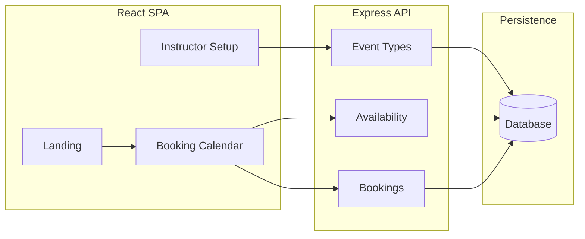
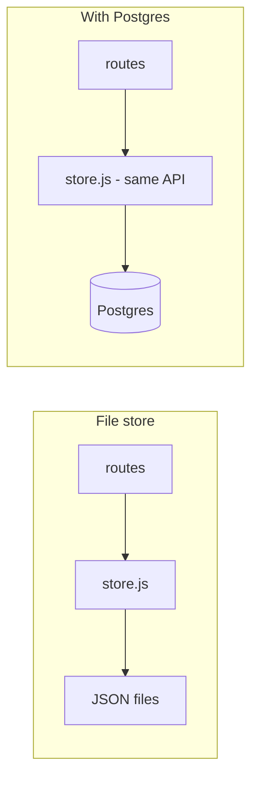

# Lesson Scheduler — Planning

This file holds the product vision and implementation plans for the Lesson Scheduler project, in sequential order. The README has product summary, how to run the app, and what’s been done.

---

## Part 1 — Product vision (v1)

**Goal:** A minimal Calendly/Cal.com-style app: public booking flow plus a single-instructor setup flow. No instructor auth in v1.

- **Student:** Landing → booking link → calendar → pick day → slots → form (name, phone, email) → submit → confirmation.
- **Instructor:** Setup UI to create/edit event types (slug, description, duration, weekly availability, mandatory fields, optional recurring). Each type gets a shareable URL.
- **Stack:** Node/Express API, React SPA. Persistence: file store or Postgres (see Part 2).

### Architecture

- Single repo: `server/` (Express), `client/` (React). Event type URL: `/book/:eventTypeSlug` (e.g. `/book/30min-intro`).

### Data model

| Concept      | Key fields |
| ------------ | ---------- |
| **EventType** | id, slug, name, description, durationMinutes, allowRecurring, recurringCount, availability (weekly pattern) |
| **Booking**   | id, eventTypeId, startTime, endTime, firstName, lastName, email, phone, optional recurringGroupId |
| **Availability** | On EventType: weekdays + start/end per day. Slots = pattern minus existing bookings. |

### Flows (v1)

1. **Student:** Landing → `/book/:slug` → load event type → calendar → pick day → `GET /api/event-types/:slug/slots?date=…` → pick slot → form → `POST /api/bookings` → success (+ optional add to calendar).
2. **Instructor:** `/setup` → list event types → create/edit (name, slug, duration, availability, recurring toggle + count) → copy booking URL.

### API (minimal v1)

| Method | Path | Purpose |
| ------ | ---- | ------- |
| GET | `/api/event-types` | List (instructor). |
| GET | `/api/event-types/:slug` | Public details for booking page. |
| GET | `/api/event-types/:slug/slots?date=YYYY-MM-DD` | Available start times. |
| POST | `/api/bookings` | Create booking(s); body: eventTypeSlug, startTime, firstName, lastName, email, phone. |
| POST | `/api/event-types` | Create event type (instructor). |
| GET | `/api/event-types/id/:id` | Get one (instructor edit). |
| PATCH | `/api/event-types/:id` | Update event type. |
| GET | `/api/bookings` | List all (instructor calendar). |

No auth in v1; optional shared secret for mutation APIs.

### Recurring bookings

- Instructor sets “Allow recurring” + number (e.g. 4). One student submit creates N bookings, same weekday/time, N weeks in a row. Recurrence rule: weekly (configurable later).

### Original implementation order (executed)

1. Project setup — server + client, migration for event_types/bookings.
2. Event types CRUD — API + instructor UI.
3. Slots API — `GET /api/event-types/:slug/slots?date=`.
4. Public booking page — calendar, slots, form, submit.
5. Create booking(s) API — validation, conflict check, insert one or N.
6. Landing page — link to `/book/:eventTypeSlug`.
7. Recurring in UI — “N weekly sessions” copy, POST creates N bookings.

### Out of scope (v1)

Instructor login; multi-tenant; custom fields; calendar sync / email reminders / timezone UI; payments; cancellation flows.

---

## Part 2 — Add real database for Vercel

**Goal:** Replace the file-based store with Postgres so event types and bookings persist on Vercel and the “Event type not found” bug when opening the booking link in a new window is fixed.

**Why:** On Vercel the app used `/tmp`, which is ephemeral and not shared between serverless invocations. A real database gives one persistent source of truth.

**Recommended:** Vercel Postgres (Neon) or Neon/Supabase; any Postgres URL works.

### Data flow (file store vs Postgres)

Routes keep calling `store.eventTypes.*` and `store.bookings.*`; only the store implementation changes (files vs SQL). No route or client changes.

### Postgres schema (two tables)

**event_types**

| Column | Type | Notes |
| ------ | ---- | ----- |
| id | SERIAL PRIMARY KEY | |
| slug | VARCHAR(255) UNIQUE NOT NULL | |
| name | VARCHAR(255) NOT NULL | |
| description | TEXT | Default '' |
| duration_minutes | INTEGER NOT NULL | Default 30 |
| allow_recurring | BOOLEAN NOT NULL | Default false |
| recurring_count | INTEGER NOT NULL | Default 1 (clamped 1–52 in app) |
| availability | JSONB NOT NULL | Array of `{day, start, end}`; default `[]` |

**bookings**

| Column | Type | Notes |
| ------ | ---- | ----- |
| id | SERIAL PRIMARY KEY | |
| event_type_id | INTEGER NOT NULL REFERENCES event_types(id) | |
| start_time | TIMESTAMPTZ NOT NULL | |
| end_time | TIMESTAMPTZ NOT NULL | |
| first_name | VARCHAR(255) NOT NULL | |
| last_name | VARCHAR(255) NOT NULL | |
| email | VARCHAR(255) NOT NULL | |
| phone | VARCHAR(255) | |
| recurring_group_id | VARCHAR(255) | Nullable |

**Indexes:** `event_types(slug)`, `bookings(event_type_id)`, `bookings(start_time)`.

### Implementation steps (executed)

1. **Create database** — Get connection URL; set `POSTGRES_URL` or `DATABASE_URL` (Vercel env or `.env` locally).
2. **Migration** — Add `server/db/schema.sql` and `server/db/migrate-pg.js`; run `npm run db:migrate-pg` once.
3. **Postgres store** — Implement `server/db/store-pg.js` with same API; snake_case columns, JSONB for availability, TIMESTAMPTZ for times.
4. **Store switcher** — In `server/db/store.js`, use Postgres when `POSTGRES_URL` set, else `server/db/store-file.js` (file store with Promise API). Routes use async/await.
5. **Optional seed** — `server/db/seed-from-json.js`; run `npm run db:seed-pg` to copy existing JSON into Postgres.
6. **Deploy and verify** — Deploy with `POSTGRES_URL` set; run migration; create event type and open booking link in new window — should load without “Event type not found”.

### Files added or changed

| Action | File |
| ------ | ---- |
| Dependencies | `package.json` — @vercel/postgres, pg; scripts `db:migrate-pg`, `db:seed-pg`. |
| Schema | `server/db/schema.sql` — CREATE TABLE event_types, bookings, indexes. |
| Migration | `server/db/migrate-pg.js` — Run schema using pg and POSTGRES_URL. |
| Postgres store | `server/db/store-pg.js` — Same API as file store. |
| File store | `server/db/store-file.js` — Promise-returning file store. |
| Switcher | `server/db/store.js` — Export store-pg or store-file by env. |
| Seed | `server/db/seed-from-json.js` — Optional seed from JSON. |
| Routes | `server/routes/*.js` — Async handlers, await store calls. |
| Docs | README — Persistence section, Postgres setup, migration, seed. |

### Risk and rollout

- **Risk:** Bugs in store-pg (e.g. date format, overlap logic) could break booking/slots. Mitigation: same semantics as file store; test create event → open link → book.
- **Rollback:** Unset `POSTGRES_URL` on Vercel to fall back to file store (data ephemeral again).
